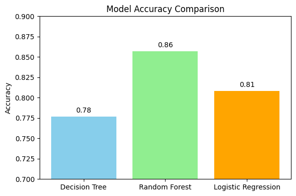

# Heart Disease Prediction using Machine Learning

[](https://www.python.org/)
[](https://scikit-learn.org/)
[](https://pandas.pydata.org/)
[](https://jupyter.org/)

This project uses machine learning to predict the presence of heart disease based on a range of clinical parameters. We implement, evaluate, and compare three different classification models—Decision Tree, Random Forest, and Logistic Regression—to identify the most effective algorithm for this critical medical diagnosis task.

**Full implementation is available on Google Colab:** **[View Notebook](https://colab.research.google.com/drive/1FMkK3WZpVOtJxPQx9Oc71QF5wCjf7Q3O?usp=sha)**

---
## 🎯 Project Objective

The primary goal is to build and evaluate a machine learning pipeline to accurately predict heart disease. This involves:
* Preprocessing and merging multiple raw medical datasets.
* Training three distinct classification models: Decision Tree, Random Forest, and Logistic Regression.
* Comparing the models based on **accuracy**, **latency**, and **throughput** to determine the most suitable algorithm for a real-world healthcare scenario.

---
## 📊 Dataset

This project utilizes a consolidated dataset created by merging three public datasets on heart disease. The final cleaned dataset contains 12 key clinical features used for prediction, including:
* `age`: Age of the patient.
* `sex`: Gender of the patient.
* `chest_pain`: Type of chest pain experienced.
* `resting_bp`: Resting blood pressure.
* `chol`: Serum cholesterol level.
* `max_hr`: Maximum heart rate achieved.
* `target`: The prediction target, where 1 indicates the presence of heart disease and 0 indicates its absence.

---
## ⚙️ Methodology

The project follows a standard machine learning workflow from data collection to model evaluation.

### 1. Data Preprocessing
The raw data from three different sources was cleaned, standardized, and merged into a single, cohesive dataset.
* **Column Standardization**: Column names were renamed to a common schema for consistency.
* **Merging & Cleaning**: The three dataframes were concatenated, and rows with any missing values were dropped to ensure data quality.
* **Label Encoding**: Categorical features like `sex` and `chest_pain` were converted into numerical values using `LabelEncoder` to make them suitable for the models.

    ```python
    # Example: Encoding Categorical Data
    from sklearn.preprocessing import LabelEncoder
    import pandas as pd

    df = pd.read_csv("Cleaned_Final_Heart_Dataset.csv")
    categorical_cols = ['sex', 'chest_pain', 'restecg', 'exang', 'slope', 'target']

    le = LabelEncoder()
    for col in categorical_cols:
        df[col] = le.fit_transform(df[col].astype(str))
    ```

### 2. Model Training
The processed dataset was split into training (80%) and testing (20%) sets. Three different classification models were then trained on this data.

---
## 📈 Results & Analysis

The performance of each model was evaluated based on accuracy, latency, and throughput.

<p align="center">
  
</p>

| Model | Accuracy | Recall (for class 1) | Latency (seconds) | Throughput (preds/sec) |
| :--- | :--- | :--- | :--- | :--- |
| Decision Tree | 78% | 75% | 0.0010 | 223,963 |
| **Random Forest** | **86%** | **90%** | **0.0547** | **4,094** |
| Logistic Regression | 81% | 79% | 0.0008 | 268,743 |

### Conclusion
The **Random Forest Classifier** emerged as the superior model for this task.
* It achieved the highest **accuracy of 86%**.
* Most importantly, it had the highest **recall of 90%** for predicting the presence of heart disease. In a medical context, a high recall is crucial as it minimizes the number of "false negatives"—cases where a person with the disease is incorrectly classified as healthy.

While Logistic Regression had the best throughput, its lower recall makes it less reliable for a primary screening tool where failing to detect a disease is a critical error.

<p align="center">
  
  <br>
  <em>Confusion Matrix for the best-performing model (Random Forest).</em>
</p>

---
## 🛠️ Technology Stack
* **Language**: `Python`
* **Libraries**: `pandas`, `NumPy`, `scikit-learn`, `Matplotlib`, `Seaborn`
* **Environment**: `Google Colab`

---
## 🚀 How to Use
1.  **Clone the repository**.
2.  **Upload the `Cleaned_Final_Heart_Dataset.csv` file.**
3.  Open the Google Colab Notebook provided in the link at the top of this README.
4.  Run the cells sequentially to reproduce the data preprocessing, model training, and evaluation steps.

---
## Team Members & Contributions
* **Balamuralikrishna Raju**: Report Writing, Data Cleaning, Decision Tree Implementation.
* **Anurag Baiju**: Data Collection, Encoding, Random Forest Implementation.
* **Bhanu Prakash Palukuri**: Related Work, Data Merging, Logistic Regression Implementation.

This project was developed for the **Cloud Machine Learning** module at the National College of Ireland.
